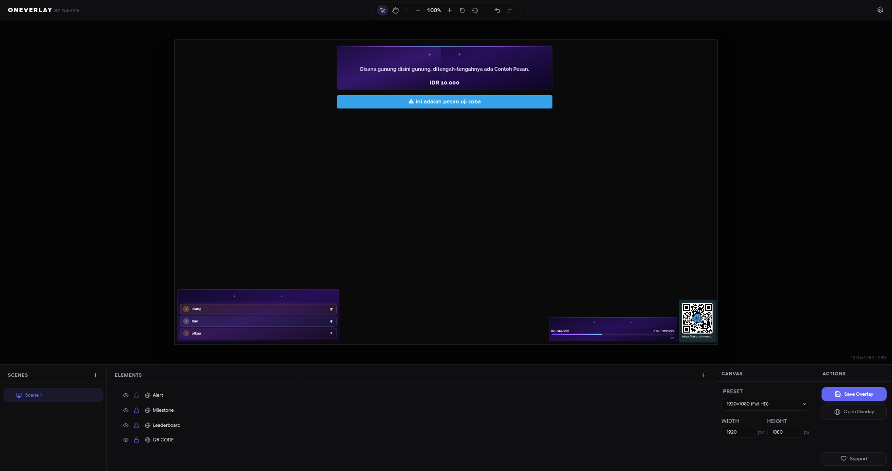

<h1 align="center">【 Oneverlay 】</h1>

<p align="center">
  <a href="https://github.com/na-ive/oneverlay/commits/main">
    
  </a>
  <a href="https://github.com/na-ive/oneverlay/stargazers">
    
  </a>
  <a href="https://tako.id/naive">
    
  </a>
</p>

<p align="center">
  <strong>Oneverlay is a premium, lightweight browser source overlay editor designed for live streamers. It provides a visual, drag-and-drop workspace that lets you compose, customize, and align overlay elements, then render them instantly in OBS Studio or any other streaming software with absolute transparency.</strong>
</p>




## Core Architecture

Oneverlay operates on a modern, full-stack serverless architecture powered by Cloudflare:
1. **Frontend (Vite + React)**: A sleek, high-performance visual WYSIWYG editor for designing scenes.
2. **Backend (Hono + Cloudflare Workers)**: A lightweight, low-latency REST API running at the edge.
3. **Cloud Database (Cloudflare D1)**: An edge-native SQL database that stores user configurations, projects, and scenes securely.
4. **OBS Synchronization (On-Load / Refresh)**: The overlay pages (`/o/:overlayCode`) query the Hono API dynamically. To conserve Cloudflare Free Tier limits, it fetches the layout once upon loading.
5. **Secret Key Portability**: Users get a unique, anonymous project key to access their workspaces from any machine without needing traditional password authentication.

## Key Features

* **Visual WYSIWYG Workspace**: Add, position, resize, rotate, scale, and crop elements (text labels, static images, and embedded web pages).
* **Multi-Scene Management**: Organize different layouts into scenes, managed under a single workspace.
* **Anonymous Accounts & Portability**: Start editing instantly. Save your project to get a `Secret Key`, which you can enter on any device to load and resume your workspace.
* **Secure Random Overlay URLs**: Overlay links use randomized 8-character codes (e.g., `/o/7j6fqxox`) to prevent route collisions and protect privacy.
* **Link Regeneration**: The owner can instantly regenerate the overlay code in settings if the link is accidentally leaked, invalidating the old URL.
* **Absolute Transparency**: The overlay engine automatically eliminates page backgrounds and containers upon rendering, leaving a clean, transparent canvas perfect for OBS.

## Quick Start

### Installation

Clone the repository and install the dependencies:

```bash
npm install
```

### Running the Development Server

To run the full-stack application locally (Vite frontend + Hono API + local D1 database):

```bash
npx wrangler dev
```

Open `http://localhost:8787` in your browser to view the landing page or design overlays.

### Adding to OBS Studio

1. In the editor, click **Open Overlay** or copy the link for your active scene (e.g., `http://127.0.0.1:8787/o/7j6fqxox`).
2. Open OBS Studio, add a new **Browser** source.
3. Paste the URL into the **URL** field.
4. Set the width and height to match your scene canvas dimensions (usually `1920` x `1080`).
5. Ensure the **Local file** checkbox is unchecked.
6. Click **OK**. (Use IP address `127.0.0.1` rather than `localhost` to avoid OBS IPv6 resolution bugs).

### Self-Hosting (Production)

Want to run your own live instance of Oneverlay on the internet for free? Check out our [Self-Hosting Guide](./docs/SELF_HOSTING.md) for step-by-step instructions on deploying to Cloudflare Workers and D1. You can also read more about the technical design in our [Architecture Overview](./docs/ARCHITECTURE.md) and [API Documentation](./docs/API_DOCUMENTATION.md).

---

## Known Limitations

1. **No Live In-Stream Editing**: You cannot edit the overlay directly from within your streaming software. Because OBS Browser Sources are designed to be display-only, you must use the Oneverlay web-based editor to move or change elements.
2. **Manual OBS Refresh**: To keep Oneverlay 100% free with absolutely zero server costs for self-hosters (staying within the Cloudflare Workers free tier), we deliberately avoided real-time WebSockets and background polling. Because of this, when you edit a scene and press Save, the changes will *not* automatically pop up on your live stream. You must right-click the Browser Source in OBS and click **"Refresh cache of current page"** to pull the latest updates. 

---

## Future Goals and Roadmap (Plan R2, Offline & Native Overlay)

Our immediate focus is continuing to expand Oneverlay into the ultimate streaming toolkit:

### 1. Cloudflare R2 Asset Hosting (Plan R2)
Currently, images must be linked via external HTTPS URLs or embedded as base64 strings.
* **Edge Storage**: Integrate Cloudflare R2 to allow drag-and-drop uploads of image assets, custom fonts, video clips, and audio directly within the editor.
* **Direct CDNs**: Automatically generate high-performance CDN URLs for uploaded assets.

### 2. Full Offline Mode
For creators who want absolute privacy, local-only performance, or need to run overlays in LAN settings without internet access:
* **IndexedDB & LocalStorage**: Store all workspace states entirely inside the browser's local sandbox.
* **Local Export/Import**: Export layouts to a standard `project.json` file on disk and re-import them.
* **Zero Cloud Dependency**: A dedicated local mode toggle that bypasses Cloudflare Workers entirely, enabling the app to run as a purely static client-side tool.

### 3. Native Overlay Elements
Support for built-in, dynamic overlay widgets directly inside Oneverlay:
* **Built-in Utility Elements**: Introduce ready-to-use widgets (such as a digital clock, timers, or custom counters) to make scene creation faster and more interactive without needing third-party integrations.


